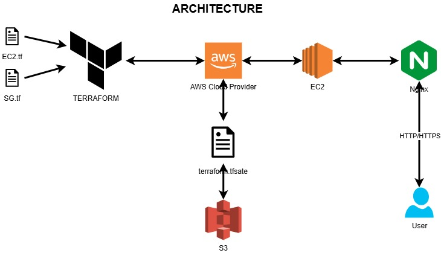

# Deploying a Web Server with Terraform

## 1. Introduction

This project uses Terraform to deploy a web server on AWS, leveraging a custom module to ensure flexibility, reusability, and maintainability. The web server is configured to run Nginx and secured with a security group that allows SSH and HTTP access.

The modular structure of the project allows for the definition of independent environments, such as Dev and QA, each with its specific configurations while sharing common elements through the module.

The main objectives of this project are:

- Automate the creation of EC2 instances configured as web servers.
- Standardize the use of AWS resources through reusable modules.
- Clearly document the process to make it easily replicable and maintainable by other teams.

This README provides a detailed guide on how to execute this project, including the required prerequisites, project structure, and steps to deploy the Dev and QA environments on AWS using Terraform.

## 2. Technical Overview and Project Structure

### **1. Architecture**



### **2. Project Structure**

```bash
web_server_module/
├── ec2.tf          # EC2 instance configuration
├── key.tf          # SSH key pair configuration
├── outputs.tf      # Module outputs
├── provider.tf     # AWS provider configuration
├── sg.tf           # Security group definition
├── variables.tf    # Module variables declaration
main.tf             # Module and environment configuration
```
This project is designed to deploy a scalable and efficient web server infrastructure in AWS using Terraform. Below, we describe the technical aspects of the project and explain the rationale behind its modular structure.

#### **Key Files in the Module:**
1. **`ec2.tf`**:
  - Creates the EC2 instance for the web server using the provided AMI and instance type.
  - Configures the server with a startup script (`user_data`) to install and start Nginx.
2. **`key.tf`**:  
  - Manages SSH key pairs for secure access to the EC2 instance.
3. **`sg.tf`**:  
  - Configures Security Group rules to allow inbound traffic for:
     - **SSH (port 22)**: For remote server management.
     - **HTTP (port 80)**: To serve web traffic.
   - Allows all outbound traffic for general communication.
4. **`provider.tf`**:  
  - Configures the AWS region to deploy the resources.
5. **`outputs.tf`**:  
  - Exposes useful information like the server's public IP and DNS for easy access.
6. **`variables.tf`**:  
  - Defines configurable parameters (e.g., AMI ID, instance type, environment).
#### **Root Module (`main.tf`):**
  - Integrates the `web_server_module` for multiple environments (e.g., Development and QA).
  - Configures remote state management using an AWS S3 bucket for consistency and collaboration.
  - Outputs the public IP and DNS of the deployed servers for quick reference.

### **3. Modular Approach**
The modular approach provides:
- **Separation of Concerns**: Logical components like EC2, security groups, and key pairs are isolated for clarity.
- **Reusability**: The `web_server_module` can be reused across multiple environments or projects with minimal changes.
- **Scalability**: Adding a new environment (e.g., Production) is straightforward by invoking the module with new parameters.

### **4. Why This Structure?**
- **Flexibility**: By parameterizing variables, the same module can be reused across environments with different configurations.
- **Maintainability**: Isolating resources in separate files ensures that updates or debugging can be performed in a targeted manner.
- **Scalability**: The modular approach allows easy scaling to add more environments or new server configurations.

This structure reflects best practices in Infrastructure as Code (IaC) and promotes efficiency, consistency, and scalability across deployments.


## 3. Prerequisites

Before starting, ensure you have the following tools and configurations:

- **Terraform**: Version 1.10.0 or higher. Install Terraform by following the [official guide](https://developer.hashicorp.com/terraform/tutorials/aws-get-started/install-cli).

- **AWS CLI**: Properly configured with your AWS account credentials. You can install it using the [AWS CLI documentation](https://docs.aws.amazon.com/cli/).

    - Use aws configure to set up your credentials and default region.

- **SSH Key Pair**:

    - Ensure you have generated a public/private SSH key pair before running Terraform. This is required to access the EC2 instances via SSH.

Generate the key pair using the following command:

```bash
ssh-keygen -t rsa -b 2048 -f "web-server-dev-key"
ssh-keygen -t rsa -b 2048 -f "web-server-qa-key"
```
Place the web-server-key.pub file in the root of the project directory.

- **S3 Bucket for Backend**:

    - Terraform's state file is stored in an S3 bucket. Ensure the bucket exists and has proper permissions. Update the backend configuration in main.tf with the bucket name, key, and region.

## 4. Pre-Deployment Configuration

Follow these steps to configure your environment before deploying resources with Terraform:

### 1. Set Up AWS CLI
Make sure your AWS CLI is configured with an IAM user that has sufficient permissions to manage:
- EC2 instances
- Key pairs
- Security groups
- S3 buckets

Run the following command to configure the AWS CLI:
```bash
aws configure
```
You will be prompted to provide:

- AWS Access Key ID
- AWS Secret Access Key
- Default region (e.g., us-east-1)

### 2. Generate SSH Keys
To access the EC2 instance via SSH, generate a public/private SSH key pair.

Run the following command to create the key pair:

```bash
ssh-keygen -t rsa -b 2048 -f "web-server-dev-key"
ssh-keygen -t rsa -b 2048 -f "web-server-qa-key"
```

Make sure the web-server-key.pub file is placed in the root directory of the project, as Terraform will use it.

### 3. Verify or Create S3 Bucket for Terraform Backend
Terraform uses an S3 bucket to store its state file. Ensure the bucket exists and has proper permissions.

If the bucket does not exist, you can create it using the AWS CLI:

```bash
aws s3api create-bucket --bucket <bucket_name> --region us-east-1
```

Enable versioning on the bucket for better state management:

```bash
aws s3api put-bucket-versioning --bucket <bucket_name> --versioning-configuration Status=Enabled
```

Update the backend block in the main.tf file with your S3 bucket name, region, and key path:

```bash
terraform {
  backend "s3" {
    bucket = "<bucket_name>"
    key    = "<path_in_bucket>/terraform.tfstate"
    region = "us-east-1"
  }
}
```
### 4. Edit Variables (Optional)
You can modify the default values in the variables.tf file to match your requirements. For example:

- `ami_id`: Specify the desired Amazon Machine Image (AMI).
- `instance_type`: Define the instance type, such as t3.micro or t3.medium.
- `server_name`: Set the server's name (e.g., web-server-dev).
- `environment`: Choose the environment (e.g., Dev, QA, Prod).

### 5. Install Terraform Providers
Run the following command to initialize Terraform and download required providers:
```bash
terraform init
```

## 5. How to Use This Project
Step-by-step instructions to execute the project:

### 1. Clone the repository:

```bash
git clone https://github.com/JesquivelR/Terraform.git
cd Terraform
```
### 2. Initialize Terraform:
```bash
terraform init
```
### 3. Review the execution plan:
```bash
terraform plan
```
### 4. Apply the plan to deploy resources:

```bash
terraform apply
```

## 6. Testing the Web Server with `curl`

After deploying the infrastructure, follow these steps to test the functionality of the web server using `curl`:

### Step 1: Obtain the Public IP or DNS of the Server
Run the following command to retrieve the public IP or DNS of the EC2 instance:
```bash
terraform output
```

Note down the values for:

`server_public_ip`

`server_public_dns`

### Step 2: Test HTTP Access Using curl

Use `curl` to send a request to the web server and verify the response.

**Test with Public IP:**

Replace `<public_ip>` with the actual IP from the Terraform output:
```bash
curl http://<public_ip>
```

If the server is running correctly, you should see the default HTML page served by Nginx.

## 7. Destroying Resources
To clean up resources and avoid unnecessary costs:
### 1. Run the following command
```bash
terraform destroy
```
### 2. Confirm the prompt with `yes`.

## Contact Information
For questions, suggestions, or collaboration, feel free to contact me:

- **Name**: Jorge Esquivel 
- **Email**: [esquivelrodriguez123@gmail.com]  
- **GitHub**: [https://github.com/JesquivelR](https://github.com/JesquivelR)  
- **LinkedIn**: [https://linkedin.com/in/esquivelrodriguez123](https://linkedin.com/in/esquivelrodriguez123)  
